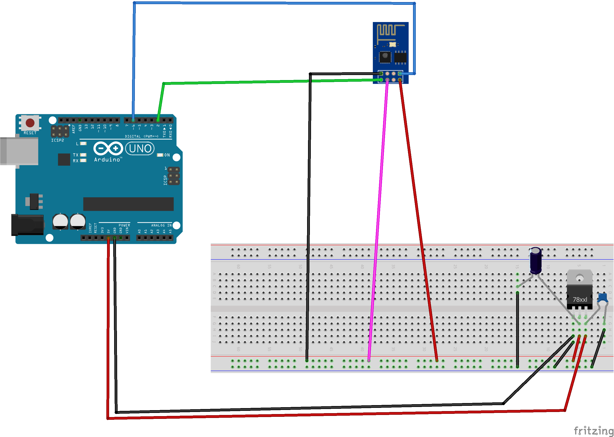

# Construction & implementation of a weather station

### Idea of a weather station

- Display of temperature and humidity values
- Display of the data on a website
- The possibility for a user to define threshold values
- Respond to particulate matter values
- Trigger events based on the sensor values

### Hardware
- Arduino Uno
- Temperature and humidity sensor DHT22
- Fine dust sensor SDS011
- LCD 1602 to display sensor data and let the users define threshold values
- ESP8266 (connected with the Arduino via UART) to display a website of the sensor values to wlan clients
- 4 pin 5V fan

### Concept development

The following flowcharts describe the workflow, how the data is queried from sensors and how it is processed.

Flow chart part 1: Start query

Flow chart part 2: DHT22

Flow chart part 3: Particulate matter sensor

Flow chart part 4: ESP

Hardware structure

General structure

ESP operation

Concept of data transfer

